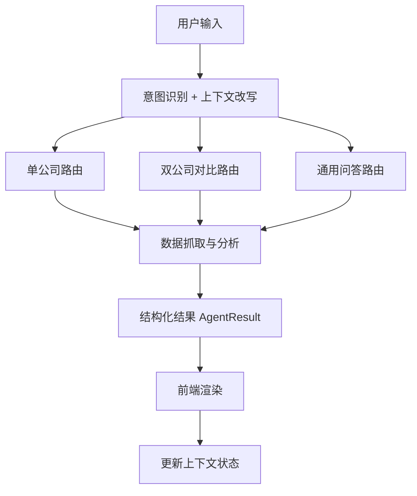

# 04 信息架构与流程图

## 信息架构

- 输入层：用户自然语言问题（公司名、股票代码、口语追问）。  
- 路由层：意图识别（单公司/对比/通用）与上下文改写。  
- 数据层：公司识别、财务指标、日线行情获取。  
- 分析层：大白话文本生成、风险提示、兜底分析。  
- 输出层：结构化 `AgentResult` + UI 分场景渲染。

## 主流程（成功路径）

1. 用户输入问题。  
2. Agent 识别意图并决定路由。  
3. 调用工具获取公司快照与财务数据。  
4. 生成分析结果（文本、评分、对比结论等）。  
5. 前端按场景渲染（单公司页或对比页）。  
6. 更新会话上下文，用于后续追问。

## 异常流程（降级路径）

1. 公司未识别：切换到通用问答模式，返回方法型分析。  
2. 数据缺失：保留已有信息并提示数据质量，避免硬失败。  
3. AI API 失败：走本地兜底文案，保证页面可输出。  
4. 前端状态异常：通过上下文清理与稳定渲染策略自恢复。

## 流程图

